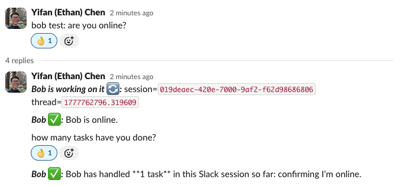

# personal-slack-agent

[](https://github.com/ethanyc216/personal-slack-agent/actions/workflows/ci.yml)
[](LICENSE)

[Setup](docs/setup.md) |
[How It Works](docs/how-it-works.md) |
[Commands](docs/command-reference.md) |
[Configuration](docs/bob-config-setup.md) |
[Publishing](docs/publishing.md) |
[Latest GitHub Release](https://github.com/ethanyc216/personal-slack-agent/releases/latest)

`personal-slack-agent` is a local Slack-to-Codex bridge. It runs a background
agent named `Bob` on your machine, watches approved Slack conversations, starts
or resumes local Codex sessions, and posts status plus results back into Slack
threads.



## Why Bob Exists

Some company environments restrict direct integrations between AI coding tools
and internal messaging systems. A team may not be able to install a Slack app,
grant OAuth scopes to a hosted connector, expose internal messages to a third
party service, or run a cloud bot that talks to Codex on the user's behalf.

Bob is built for that constraint. Instead of acting as a hosted Slack app, Bob
runs locally beside Codex and uses a browser-authenticated Slack Web session that
the user already controls. Work still happens on the user's machine, while Slack
becomes the coordination surface: prompts, progress, waiting states, approvals,
and final answers remain visible in the approved company messaging system.

The goal is not to replace Codex. The goal is to make Codex work trackable from
Slack when Slack is where the team already coordinates.

## What Bob Does

- Watches configured Slack channels or explicitly allowed runtime conversations.
- Accepts messages that invoke a configured Slack callsign such as `Bob` or `bob`.
- Starts a new local Codex session for a new Slack thread.
- Resumes the same local Codex session when someone replies in that thread.
- Posts working, waiting, approval, error, and final messages back to Slack.
- Lets terminal-originated requests use the same Slack-thread-backed workflow.
- Keeps per-channel memory policy explicit so shared channels do not update
  personal durable notes by accident.

## How It Works

At a high level:

1. Bob attaches to a local Chrome session that is already logged into Slack.
2. Bob watches Slack Web realtime events and targeted Slack Web API responses.
3. When an allowed user invokes Bob, Bob creates or resumes local Codex work.
4. Bob posts lifecycle updates and final output back into the Slack thread.

The Slack thread is the human-readable work log. The local state database maps
Slack threads to Codex session ids so later Slack replies can continue the same
conversation.

For a deeper architecture walkthrough, see [docs/how-it-works.md](docs/how-it-works.md).

## Current Status

The project is functional but still experimental.

Working pieces include:

- package install and CLI entry points
- config generation and validation
- background watcher loop
- websocket-first Slack event detection
- targeted Slack API hydration for channel roots and thread replies
- thread/session mapping to local Codex sessions
- thread reply resume for existing sessions
- waiting-state reminders and auto-close handling
- manual `<callsign> close` thread closure with later resume support
- cleanup of obsolete waiting prompts after resolution
- local process control with `bobctl start|stop|restart|status|tail-log|show-config|doctor`
- GitHub Actions CI, generated GitHub Releases, manual TestPyPI publishing, and
  PyPI publishing from generated release artifacts

Current constraints:

- macOS only
- Chrome or Chromium required
- Slack integration uses Slack Web realtime sockets plus browser-session-backed
  Slack Web requests, not an official Slack app install
- broad Slack message edit/delete flows are still limited beyond targeted
  waiting-prompt cleanup
- browser/web request behavior may need adjustment if Slack changes private web
  client APIs or websocket behavior

## Quick Start

For a full first-time setup, use [docs/setup.md](docs/setup.md).

### Local Development

Use an editable install when working from a repo checkout:

```bash
python3 -m venv .venv
.venv/bin/python -m pip install -U pip
.venv/bin/python -m pip install -e '.[dev]'
```

### TestPyPI Install

Use TestPyPI only for release testing. Install in a throwaway virtual
environment so the package does not conflict with an editable local Bob install:

```bash
python3 -m venv /tmp/bob-testpypi
/tmp/bob-testpypi/bin/python -m pip install --upgrade pip
/tmp/bob-testpypi/bin/python -m pip install \
  --index-url https://test.pypi.org/simple/ \
  --extra-index-url https://pypi.org/simple/ \
  personal-slack-agent
```

`--extra-index-url` lets pip resolve normal dependencies such as Playwright from
PyPI when they are not available on TestPyPI.

### PyPI Install

After the project has a real public PyPI release, install from PyPI with:

```bash
python3 -m venv .venv
.venv/bin/python -m pip install --upgrade pip
.venv/bin/python -m pip install personal-slack-agent
```

Generate local config:

```bash
.venv/bin/bob-init
```

The wizard prompts for the owner identity, Slack workspace URL, channel, default working directory,
and channel memory policy, then writes a validated config:

```text
~/.config/personal-slack-agent/bob.toml
```

Also included in the repo:

```text
config/bob.sample.toml
docs/setup.md
docs/bob-config-setup.md
docs/command-reference.md
```

### Example config

```toml
[defaults]
owner_name = "Bob Owner"
owner_preferred_name = "Owner"
# Optional Slack callsigns. Empty or omitted falls back to ["Bob"].
assistant_names = ["Bob"]

[browser]
slack_signin_url = "https://slack.com/signin?entry_point=nav_menu#/signin"
browser_mode = "shared_browser"
browser_url = "http://127.0.0.1:9222"
cdp_url = "http://127.0.0.1:9222"
browser_user_data_dir = "/Users/you/.cache/personal-slack-agent/chrome-profile"

[runner]
bob_codex_home = "/Users/you/.local/share/personal-slack-agent/codex-home"
codex_exec_timeout_seconds = 600

[lifecycle]
reminder_minutes = [30]
auto_close_minutes = 120

[orchestrator]
max_concurrent_tasks = 1
max_concurrent_per_thread = 1

[watcher]
root_batch_size = 50
thread_batch_size = 200
thread_reply_rate_limit_backoff_seconds = 60
recent_terminal_thread_reconcile_limit = 6
periodic_terminal_thread_reconcile_batch_size = 1
historical_terminal_thread_reconcile_base_interval_seconds = 60
historical_terminal_thread_reconcile_max_interval_seconds = 900
bob_ultimate_mode = false

[[workspaces]]
name = "my-workspace"
slack_url = "https://app.slack.com/client/T12345678/C12345678"
slack_api_origin = "https://example.enterprise.slack.com"
slack_api_token = "xoxc-..."

[workspaces.channel_defaults]
allowed_actor_ids = ["U12345678"]
default_cwd = "/Users/you/Code"
additional_roots = ["/Users/you/Code"]
accept_root_bob_requests = true
codex_home_mode = "default"

[[workspaces.channels]]
name = "my-private-channel"
allowed_actor_ids = ["U12345678"]
persistent_memory_mode = "owner_only"
persistent_memory_owner = "bob_owner_handle"

[[workspaces.channels]]
name = "my-shared-bob-channel"
codex_sandbox_mode = "workspace-write"
persistent_memory_mode = "disabled"
```

`watcher.bob_ultimate_mode = false` preserves the current configured-channel Bob behavior. Set `watcher.bob_ultimate_mode = true` to allow explicit configured-callsign invocation from any accessible public/private channel, DM, or group DM, still restricted by `allowed_actor_ids`; in that mode Bob appends working and final status into the invoking message instead of posting a separate Bob reply for that invocation.

`defaults.assistant_names` controls Slack-facing callsigns. If omitted or set to an empty list, Bob uses the legacy callsign `Bob`. You can configure aliases such as `["Bob", "Bobby", "Copilot"]`; matching is case-insensitive with a name boundary, and Bob replies using the configured spelling of the matched alias.

The operational command names are fixed and do not change with Slack callsigns: `bob`, `bobctl`, `bob-agent`, and `bob-init` remain the commands.

### Important config notes

For a field-by-field explanation of `bob.toml`, see:

```text
docs/bob-config-setup.md
```

- `allowed_actor_ids`
  At `[workspaces.channel_defaults]`, this defines who may trigger or resume Bob work in that workspace's channels by default.
  Optionally set it again on `[[workspaces.channels]]` to override that workspace default for one channel.

- `owner_name` / `owner_preferred_name`
  At `[defaults]`, these define how Bob refers to the human owner in runtime prompts.
  For committed examples, keep these anonymized.

- `assistant_names`
  At `[defaults]`, this defines the Slack callsigns that can invoke Bob. Bob replies using
  the exact alias the user typed for that interaction. If omitted or empty, the default is `["Bob"]`.

- `workspaces.channel_defaults`
  Use this to define the default cwd, roots, Bob acceptance policy, and Codex sandbox/home behavior
  that should apply to channels in one workspace unless a channel overrides them directly.

- `slack_url`
  This should point to any Slack client URL inside the target workspace.
  Bob resolves per-channel ids from the rendered sidebar DOM at startup, so channels only need names in config.

- `slack_api_origin`
  This is the same-origin Slack web host Bob will use for browser-session-backed `/api/...` calls.

- `slack_api_token`
  This is currently the browser-session token used for the private Slack web API path.
  Treat it as sensitive.

- `post_terminal_threads_here`
  Channels with this flag can be targeted by the `bob` terminal wrapper for terminal-originated Bob requests.
  If exactly one channel across your config has this flag, `bob "<prompt>"` can use it by default.

- `persistent_memory_mode`
  Required for every configured channel.
  Use `owner_only` for a private channel that is allowed to update one person's durable preference notes.
  Use `disabled` for shared or test channels that must not update personal durable notes.

- `persistent_memory_owner`
  Required only when `persistent_memory_mode = "owner_only"`.
  This identifies whose durable preference notes the channel may update.

- `slack_channel_id`
  Optional per channel.
  Use this when Slack does not expose the channel in the rendered sidebar for Bob's browser session.
  If provided, Bob will seed the channel route directly instead of relying on sidebar discovery for that channel.

### Automatic Slack auth bootstrap

If the target workspace is already open in your debuggable Chrome session, you can populate
`slack_api_origin` and `slack_api_token` automatically:

```bash
.venv/bin/bob-init --discover-slack-auth --workspace my-workspace
```

- `browser_mode`
  Supported values:
  - `shared_browser`
  - `dedicated_browser`

## Chrome setup

Bob expects a debuggable Chrome session.

Start Chrome with remote debugging enabled:

```bash
open -na "Google Chrome" --args \
  --remote-debugging-port=9222 \
  --user-data-dir="$HOME/.cache/personal-slack-agent/chrome-profile" \
  --no-first-run \
  --no-default-browser-check \
  "https://slack.com/signin?entry_point=nav_menu#/signin"
```

In that Chrome instance:

1. open `chrome://inspect/#remote-debugging`
2. enable remote debugging
3. log into Slack
4. open any page inside the workspace you configured

## Bob Chrome Dock Launcher

Install the reusable debug-browser app:

```bash
.venv/bin/bobctl install-chrome-launcher --force
```

This writes `~/Applications/Bob Chrome.app`.

At install time, Bob renders that launcher from the current `[browser]` config in `bob.toml`:

- `browser.cdp_url`
- `browser.browser_user_data_dir`
- `browser.chrome_executable_path` when set

If you use a non-default config file, pass it when installing:

```bash
.venv/bin/bobctl install-chrome-launcher --config ~/.config/personal-slack-agent/bob.toml --force
```

Behavior:

- if the configured `browser.cdp_url` is already live, it just foregrounds the configured Chrome app
- otherwise it launches a fresh debug-enabled Chrome instance using the configured app/profile settings
- it does not open Slack or any other URL automatically

`Bob Chrome.app` is safe to pin to the macOS Dock.
If you later change the `[browser]` settings, rerun the same install command to refresh the installed app, including `--config ...` when you use a non-default config file.

This launcher is for the browser only. Bob itself still must be started or restarted from a normal unsandboxed shell.

## Usage

For a command-by-command operator reference, see [docs/command-reference.md](docs/command-reference.md).

### Start Bob in background

```bash
.venv/bin/bobctl start --config ~/.config/personal-slack-agent/bob.toml --poll-interval-seconds 10
```

Run a live smoke test:

```bash
.venv/bin/bobctl smoke-test --workspace my-workspace --channel my-private-channel
```

Restart Bob:

```bash
.venv/bin/bobctl restart --config ~/.config/personal-slack-agent/bob.toml --poll-interval-seconds 10
```

Tail logs:

```bash
.venv/bin/bobctl tail-log --lines 50
```

Stop Bob:

```bash
.venv/bin/bobctl stop
```

### One-shot cycle

For debugging:

```bash
.venv/bin/bob-agent --once --config ~/.config/personal-slack-agent/bob.toml
```

### Triggering work from Slack

Send a message in a watched channel that starts with a configured callsign, for example:

```text
Bob, summarize this repo
```

Bob will:

1. create or use the Slack thread for that request
2. start a local Codex session
3. post:
   - `_*Bob is working on it :arrows_counterclockwise::*_ <session-id>`
4. post final output as:
   - `_*Bob :white_check_mark::*_ ...`

If you reply in the thread later, Bob resumes the same local Codex session.

If Bob is waiting for input or approval:

- configured reminders apply only to those waiting states
- auto-close applies only to those waiting states
- reply with `<callsign> close` to close the thread without losing the underlying Codex session
- reply again later in the same thread to resume

### Terminal Requests

You can start a Bob request from the terminal with the `bob` wrapper:

```bash
.venv/bin/bob --workspace my-workspace --channel my-private-channel "summarize this repo"
```

## Docs

- [Setup guide](docs/setup.md): install, Chrome setup, first config, smoke test.
- [How it works](docs/how-it-works.md): motivation, architecture, and message flow.
- [Config guide](docs/bob-config-setup.md): field-by-field `bob.toml` reference.
- [Command reference](docs/command-reference.md): `bob`, `bob-agent`, `bob-init`, and `bobctl`.
- [Publishing guide](docs/publishing.md): GitHub Releases, TestPyPI, PyPI options, and package exposure.
- [Slack client findings](docs/slack-client-findings.md): implementation notes from Slack Web inspection.
- [Sample config](config/bob.sample.toml): committed anonymized config template.

## Release And Publishing

GitHub Releases are generated automatically from successful pushes to `main`.
Each generated release uploads a wheel and source distribution as downloadable
release assets.

TestPyPI publishing is configured but manual. PyPI publishing is wired to run
after each successful generated GitHub Release once the PyPI Trusted Publisher
and GitHub `pypi` environment are configured. The PyPI workflow downloads the
exact wheel and source distribution from the GitHub Release, so the PyPI package
version matches the release tag. The same workflow can also publish an existing
GitHub Release tag manually as a fallback.

See [docs/publishing.md](docs/publishing.md) for the setup values and release
workflow details.

The CI badge above updates when GitHub renders the README. The latest-release
link resolves through GitHub to the current latest release. Literal version
numbers in README prose only change when a commit changes them.

## Security Notes

- `slack_api_token` is sensitive and should not be committed.
- Do not publish personal `bob.toml` files.
- Do not share the Chrome profile used for Slack browser auth.
- Treat GitHub Releases, TestPyPI, and PyPI as public distribution channels.
- Published Python wheels contain readable `.py` source files.

## Project Layout

- `src/personal_slack_agent/`: package source
- `tests/`: automated tests
- `config/bob.sample.toml`: anonymized sample config
- `docs/`: setup, operation, architecture, and publishing docs
- `.github/workflows/`: CI, release, TestPyPI, and PyPI workflows
- `pyproject.toml`: package metadata

## Testing

Run the full test suite:

```bash
.venv/bin/python -m pytest -q
```

## License

This project is licensed under the MIT License. See [LICENSE](LICENSE).
